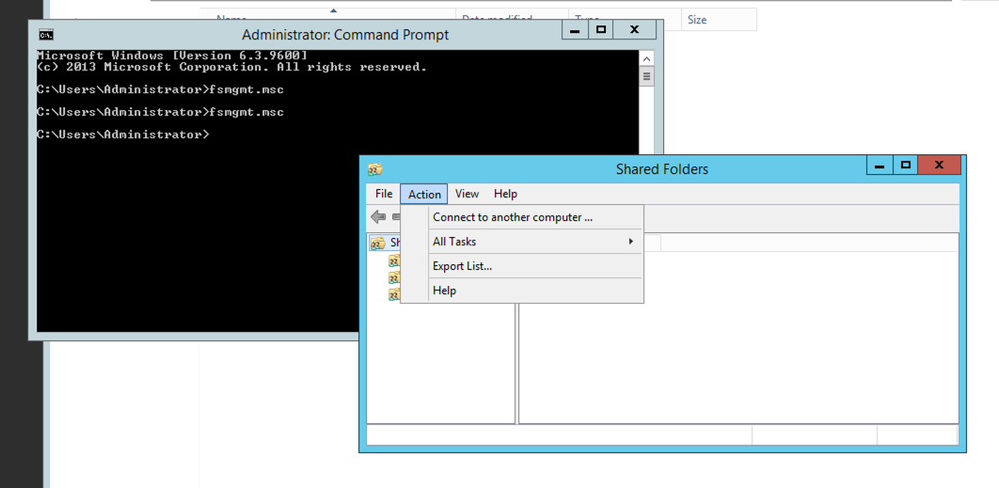
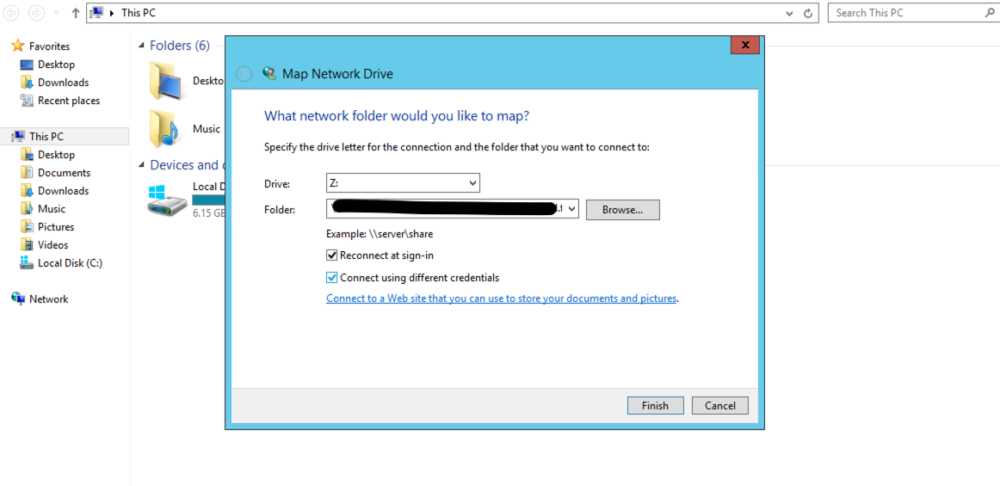
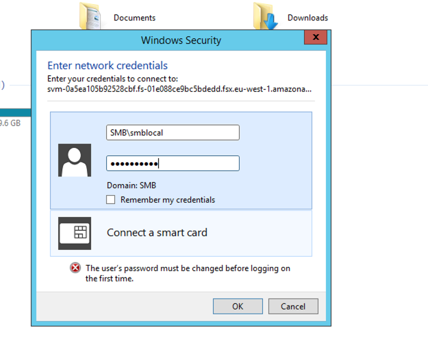
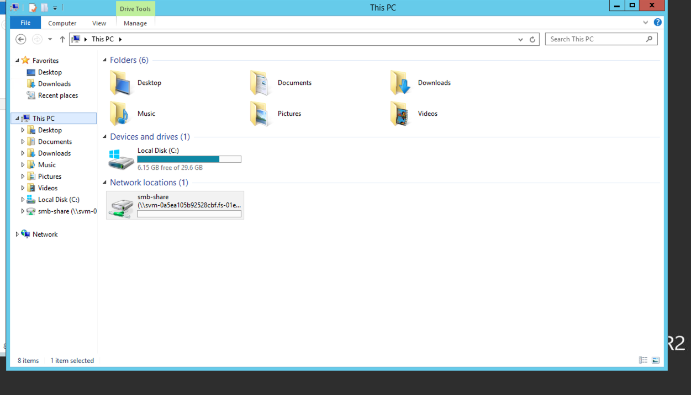
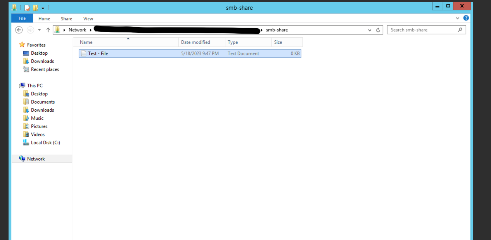

# [create-smb-shares](https://docs.aws.amazon.com/fsx/latest/ONTAPGuide/create-smb-shares.html)
1. Run  fsmgmt.msc as Administrator

   
2. For Action, choose Connect to another computer.

3. For Another computer, enter the DNS name for your storage virtual machine (SVM)

4. Choose OK. An entry for your Amazon FSx file system then appears in the list for the Shared Folders tool.

5. Map the file share from file finder

6. Enter workgroup/local user and password

   
7. Browse to the SMB folder

   
Add a file to verify
